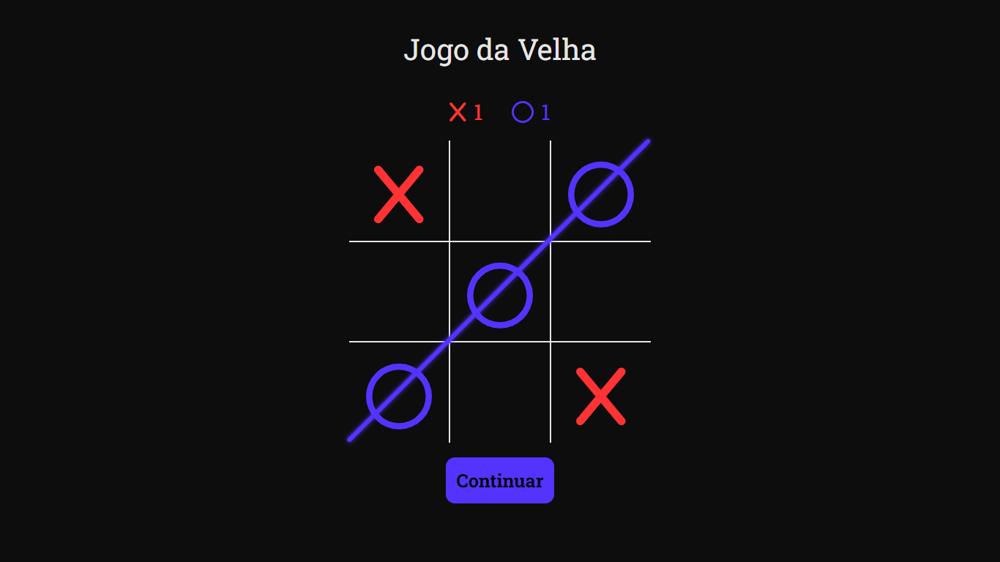

# React Tic Tac Toe

[![Button Shield]](https://deyvidfernandes.github.io/react-tic-tac-toe/)

> Projeto de "jogo da velha" criado para praticar desenvolvimento com React e TypeScript. Inclui contadores de vitórias, animações e mensagens de final de jogo personalizadas.

[Button Shield]: https://img.shields.io/badge/Acesse%20o%20deploy%20do%20projeto!-007ec6?style=for-the-badge
